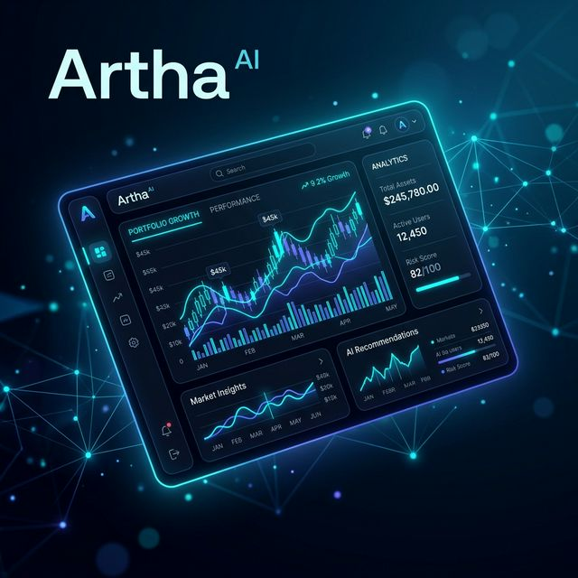

# Artha Mentor: AI Finance Mentor

Artha is a high-end financial simulation platform built for professional financial planning. It integrates real-time market news from **The Economic Times**, powerful **FIRE (Financial Independence, Retire Early)** simulation math, and a multi-agent AI fallback system for 100% uptime.

**[Read the Full AI Architecture & Technical Workflow Here](./AI_ARCHITECTURE.md)**

## Getting Started

Follow these precise steps to run Artha Mentor seamlessly on your local machine.

1. Ensure you have Node.js version 18 or above installed.
2. Clone this repository and configure your local `.env` to include:
   - `GEMINI_API_KEY`
   - `FALL_BACK_API_1` & `FALL_BACK_API_2`
   - `TAVILY_API_KEY` (for live market news)
3. Open your terminal in the root directory.
4. Execute `npm install` to download all strict dependencies.
5. Execute `npm run dev` to launch the Next.js local development server.
6. Open your web browser and navigate to `http://localhost:3000`.
